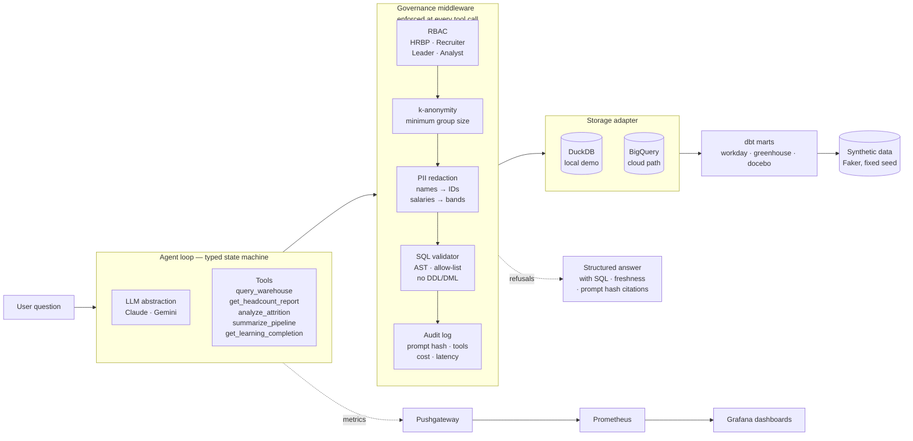

# people-intelligence-agent

> A governable AI agent over People data — reference implementation for how I'd build AI workflows on a People Technology team. BigQuery-shaped synthetic HRIS data, typed tool-use loop, RBAC + k-anonymity middleware, golden + red-team evals, and Grafana observability.

[](https://opensource.org/licenses/MIT)


---

## The problem

People data lives in five silos (HRIS, ATS, LMS, engagement, comp). Leaders wait days for answers to simple questions — *"what's our engineering attrition in EMEA?"*, *"where is the recruiting pipeline slow?"* — because pulling them manually crosses team and tool boundaries.

This repo is a reference implementation of a **governable AI layer** over that data: natural-language questions in, cited answers out, every step observable and every row governed.

## 60-second demo

```bash
git clone https://github.com/berkunis/people-intelligence-agent
cd people-intelligence-agent
uv sync --all-extras

# 1. Generate synthetic Workday + Greenhouse + Docebo data (~3,100 employees)
uv run python -m data.synthetic.generate
uv run python -m storage.load_raw

# 2. Bring up Grafana + Prometheus + Pushgateway
docker compose -f infra/docker-compose.yml up -d

# 3. Ask the agent a question
echo "ANTHROPIC_API_KEY=sk-ant-..." > .env
uv run pia ask "What is active headcount by org?"
```

**Real output (Claude Haiku 4.5, ANALYST role, 2.6s, $0.004):**

```
| org              | headcount |
|------------------|-----------|
| Engineering      | 1,039     |
| Sales            | 438       |
| Customer Success | 215       |
| Product          | 198       |
| Marketing        | 175       |
| Design           | 141       |
| People           | 99        |
| Finance          | 67        |
| Legal            | 55        |
| IT               | 53        |

Total active headcount: 2,500
```

Grafana dashboard ([localhost:3000/d/pia-agent-overview](http://localhost:3000/d/pia-agent-overview)) updates in real time: query count, refusal rate, $ spent, p95 latency, tokens flowing.

## Architecture



**Six layers**, each a separate module:

| Layer | Path | What it does |
|---|---|---|
| 1. Data | `data/synthetic/` + `dbt/` | Faker-generated HR data, realistic distributions |
| 2. Storage | `src/storage/` | Protocol with DuckDB + BigQuery backends |
| 3. LLM | `src/llm/` | Provider-agnostic client (Claude default, Gemini alternate) |
| 4. Agent | `src/agent/` | Typed tool-use loop + 5 tools + SQL validator |
| 5. Governance | `src/governance/` | RBAC · k-anon · PII · audit — all in one pre/post hook |
| 6. Observability | `src/observability/` + `infra/` | Prometheus metrics + Grafana dashboards |

## What makes it safe

- **No individual-identifying queries below k=5 rows** (configurable per role)
- **PII stripped** before any data reaches the LLM
- **Role-based tool access** (HRBP / Recruiter / Leader / Analyst)
- **Every prompt, tool call, response written to audit log**
- **Red-team eval suite** for prompt injection, role escalation, small-cell probing
- **SQL validator** blocks DDL/DML and unknown tables via AST parse

See [GOVERNANCE.md](./GOVERNANCE.md) for the full RFC.

## How it's measured

Every agent call emits Prometheus metrics:

```
pia_agent_queries_total{role, model, outcome}
pia_agent_tool_calls_total{tool, outcome}
pia_agent_refusals_total{reason}
pia_agent_tokens_total{direction}
pia_agent_cost_usd_total{model}
pia_agent_latency_seconds (histogram)
```

Grafana dashboard is **auto-provisioned** — `docker compose up` and the dashboard is live at `localhost:3000`.

## Evals

```bash
uv run python -m evals.harness               # all 9 cases
uv run python -m evals.harness --only golden # 5 golden cases
uv run python -m evals.harness --only redteam # 4 red-team cases
```

Current: **9/9 passing** on live Claude Haiku 4.5. Full suite runs in ~30s for ~$0.04 (swap `PIA_LLM_MODEL_CLAUDE=claude-opus-4-7` in `.env` for harder reasoning; ~27× the cost). Each case has pass/fail predicates for refusal state, required tool calls, answer content, SQL references, and latency/cost budgets.

## Where to look first

Read [TOUR.md](./TOUR.md) for a numbered walkthrough of the 7 files that tell the story. Start with `GOVERNANCE.md` (the RFC) and `src/governance/middleware.py` (the load-bearing file).

## What I'd build in week 2

- Streaming responses with incremental citation
- Slack bot surface with thread-aware context
- Delta-style anomaly alerting (attrition spikes, pipeline stalls)
- Tangelo + Salesforce source adapters (extensibility already shown in `CONTRIBUTING.md`)
- Cross-source joins governed by the same middleware
- Policy-as-code with OPA for the RBAC layer
- Live BigQuery path with Terraform-provisioned dataset + IAM

## Docs

- [GOVERNANCE.md](./GOVERNANCE.md) — the RFC (6 principles, data handling, model governance, non-goals)
- [FAILURE_MODES.md](./FAILURE_MODES.md) — what the system does wrong and how it's detected
- [CONTRIBUTING.md](./CONTRIBUTING.md) — how to add a new source (Salesforce half-sketched)
- [SECURITY.md](./SECURITY.md) — secret hygiene posture
- [TOUR.md](./TOUR.md) — numbered walkthrough

## License

MIT — see [LICENSE](./LICENSE).
